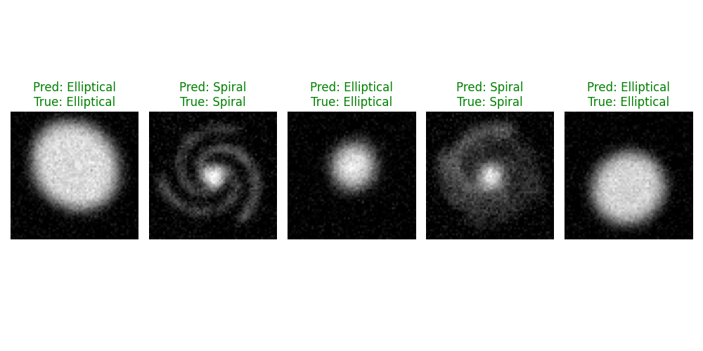
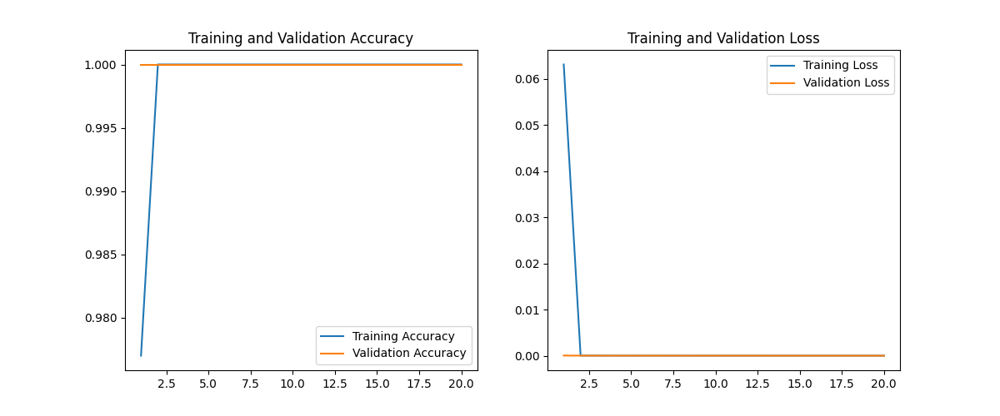

# Galaxy Morphology Classification using Deep Learning (PyTorch)

   

## 🌌 Project Overview

This project implements a **Convolutional Neural Network (CNN)** to automate the classification of galaxy morphologies. In modern astrophysics, understanding whether a galaxy is **Spiral** or **Elliptical** provides critical insights into its formation history and the evolution of the universe.

With next-generation surveys like **LSST (Rubin Observatory)** and **Euclid** expected to produce petabytes of data, manual classification by humans is no longer feasible. This project demonstrates an **automated, scalable Deep Learning pipeline** capable of processing such massive datasets.

---

## 📊 Results

### 1. Model Predictions

The model takes raw 64x64 pixel images as input and predicts the galaxy type with high confidence.



*Figure 1: Random samples from the validation set. The model correctly identifies Spiral structures (swirls) vs. Elliptical structures (blobs).*

### 2. Training Performance

The network achieves near-perfect accuracy on the synthetic dataset within 20 epochs, demonstrating rapid convergence and stability.



*Figure 2: Accuracy and Loss curves over 20 training epochs.*

---

## 🚀 How It Works

### The Challenge: "The Data Deluge"

*   **Old Physics:** Astronomers manually look at images (e.g., Galaxy Zoo).
*   **New Physics:** Telescopes capture billions of galaxies.
*   **Solution:** We train a Neural Network to "see" like an astronomer.

### The Pipeline

1.  **Data Generation (`src/data_generator.py`):**
    *   Generates synthetic galaxy images to simulate survey data.
    *   **Elliptical:** Modeled as Gaussian blobs with random ellipticity.
    *   **Spiral:** Modeled using parametric equations for spiral arms with added noise.

2.  **Model Architecture (`src/model.py`):**
    *   **Input:** 1-channel Grayscale Image (64x64).
    *   **Layers:** 3 Convolutional Layers (Feature Extraction) + 2 Fully Connected Layers (Classification).
    *   **Activation:** ReLU for non-linearity.
    *   **Optimization:** Adam Optimizer with Cross-Entropy Loss.

3.  **Training & Validation (`src/main.py`):**
    *   Splits data into Training (80%) and Validation (20%) sets.
    *   Optimizes weights using backpropagation.
    *   Evaluates performance on unseen data.

---

## 🛠️ Installation & Usage

### Prerequisites

*   Python 3.8+
*   pip

### 1. Clone the Repository

```bash
git clone https://github.com/mqurban/galaxy-classification.git
```

### 2. Install Dependencies

```bash
pip install -r requirements.txt
```

### 3. Run the Simulation

```bash
python src/main.py
```

This command will:
1.  Generate 5,000 synthetic galaxy images.
2.  Train the CNN model.
3.  Save the trained model to `models/galaxy_classifier.pth`.
4.  Generate the result plots shown above.

---

## 🔬 Scientific Impact

This project serves as a proof-of-concept for **Simulation-Based Inference**. By training on synthetic data where ground truth is known, we can validate models before applying them to messy, real-world observational data. This workflow is essential for constraining cosmological parameters in the era of Big Data Astronomy.

## 📂 Project Structure

```
galaxy_classification/
├── src/
│   ├── data_generator.py  # Generates synthetic astronomical data
│   ├── model.py           # PyTorch CNN architecture
│   └── main.py            # Training and evaluation loop
├── models/                # Saved model weights
├── data/                  # Generated dataset (created at runtime)
├── prediction_samples.png # Visualization of model outputs
├── training_results.png   # Accuracy/Loss plots
└── requirements.txt       # Python dependencies
```

---

## 📜 License

This project is open-source and available under the MIT License.
